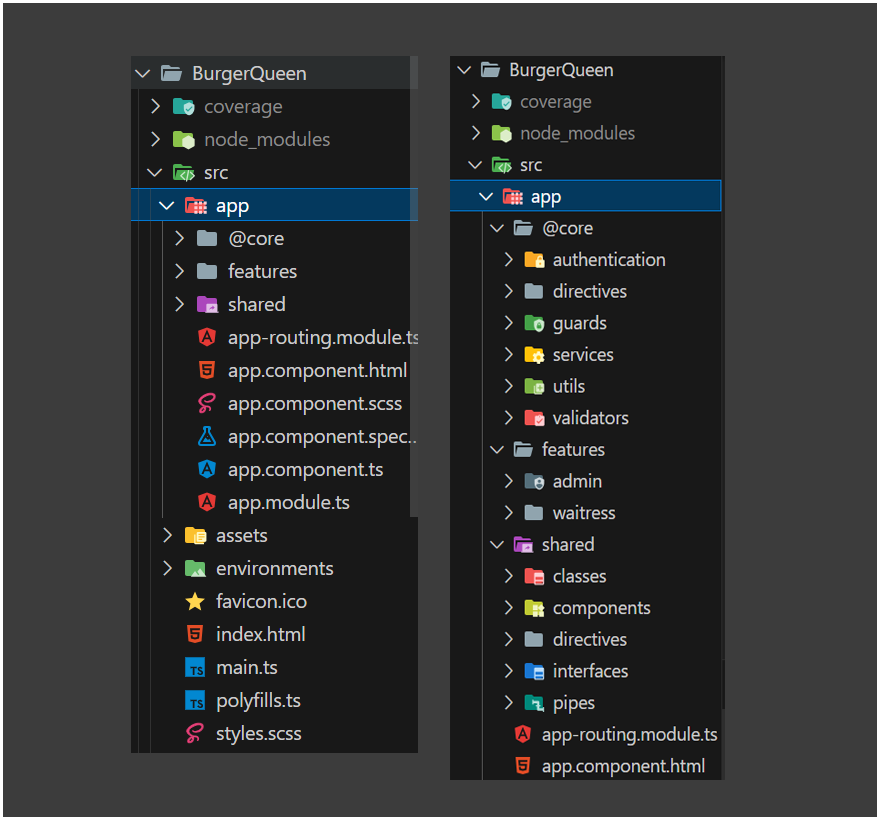
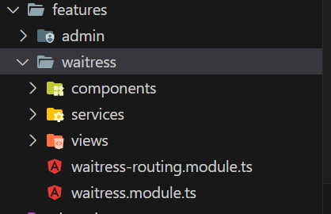
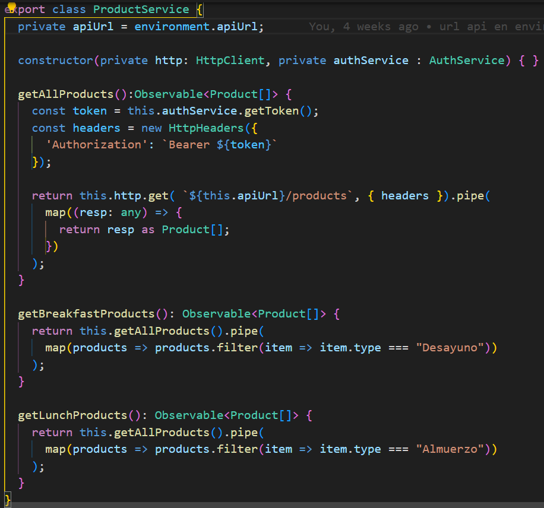

# Burger Queen (API Client)

## Índice

* [1. Introducción](#1-introducción)
* [2. Resumen del proyecto](#2-resumen-del-proyecto)
* [3. Arquitectura](#3-arquitectura)
* [4. Consideraciones](#4-consideraciones)

***

## 1. Introducción
 Este repositorio ha sido creado con el propósito de proporcionar a nuestro equipo de coaches una herramienta centralizada para guiar y estandarizar el proceso de aprendizaje del framework de frontend [Angular](https://angular.io/).

 El objetivo principal de este proyecto es establecer un conjunto de mejores prácticas y estándares de desarrollo en Angular 14, que servirán como referencia para que el equipo trabaje y comunique siguiendo una misma linea.

## 2. Resumen del proyecto
Burger Queen API Client - [Read me](https://github.com/Laboratoria/DEV009-burger-queen-api-client)

En resumen , un pequeño restaurante de hamburguesas, que está creciendo, necesita un
sistema a través del cual puedan tomar pedidos usando una _tablet_, y enviarlos
a la cocina para que se preparen ordenada y eficientemente.
Nuestro Frontend se conectará con el [Backend](https://app.swaggerhub.com/apis-docs/ssinuco/BurgerQueenAPI/2.0.0) provisto.

## 3. Arquitectura

* **Estructura de carpetas**

Se optó por crear una estructura , donde algunas posiblemente queden sin utilizarse. Esto es , a modo ilustrativo, para poder visualizar y mostrar a las estudiantes como podria llegar a ser la estructura de un proyecto más robusto o donde podrian ir guardando sus distintos recursos si en algún momento decidiera complejizar su proeycto.

* **Cración de Módulos**

Se creó un modulo por perfil de usuario. Cada módulo cuenta con una organización interna que nos permite encontrar facilmente sus componentes, servicios, vistas y ruteo. Estos módulos se encuentran dentro de la carpeta principal "features".

## 4. Consideraciones

* **Uso de Rutas hijas**

En nuestro app-routing.modules.ts

en el routing de uno de nuestros modulos. ej: waitres-routing.module.ts

En este ejemplo , la ruta orders/create nos llevará a la vista de mesera de Crear Orden.

* **Protección de rutas**

Para la protección de rutas se usaron Guards de tipo CanActivate. Se creó una para identificar si el user está logueado, y otra para verificar bajo qué rol se encuentra.(Se pueden ver en la imágen anterior)

* **NO recomendamos el uso de Interceptors**

La incorporación del token en el header se realiza en cada petición . Se pe recurre a un servicio propio para traernos el token . 

* **Manejo de Observables**

Se recomienda el trabajo con Observables a la estudiantes y se sugiere investigar los operadores básicos de rxjs como por ejemplo .pipe o .map ya que son muy utilizados en la diaria laboral.
(podemos ver como se utilizan en la foto anterior)

* **Separación de responsabilidades entre componentes y servicios**

Procurar que la mayor cantidad de lógica quede en el servicio, de forma tal que en mi componente se reciba unicamente la información que se precisa. Por ejemplo, en este caso , el filtrado de los productos según el tipo de menú se produce en el servicio y no en el componente . 

* **Estilos**

Para los estilos se decidió trabajar con [SCSS](https://sass-lang.com/guide/#variables) por los beneficios y claridad que aportan. 
Teniendo en cuenta que Angular se encarga por si solo de compilarlo a css.

